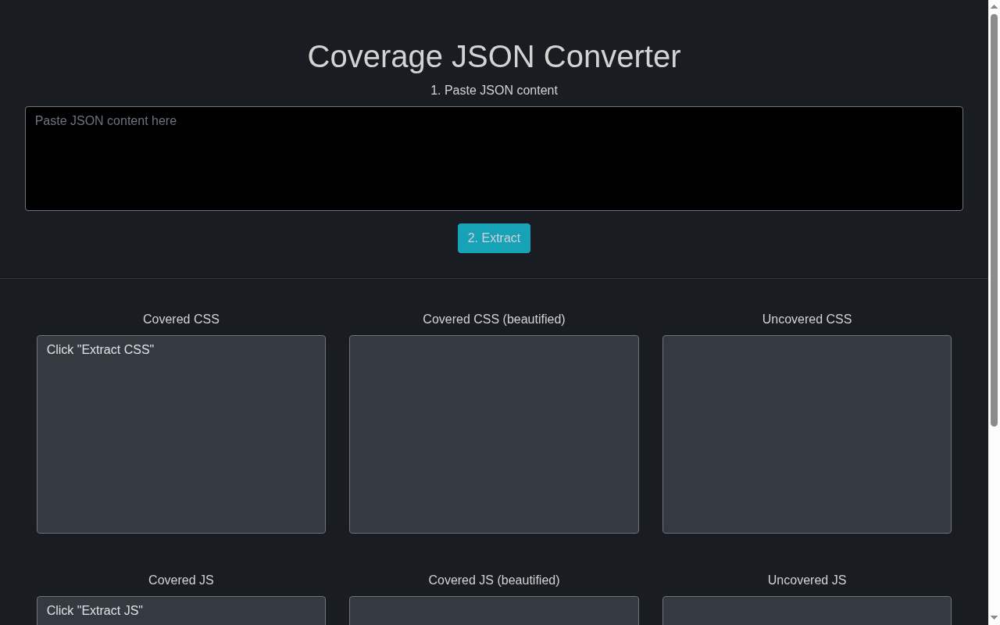

# DevTools Coverage Extractor

Extract the **covered and uncovered CSS and JS** of a website from a Chrome DevTools coverage report. Based on [devtools-coverage-css-generator](https://github.com/nachovz/devtools-coverage-css-generator), extended with a JavaScript extractor.

**Live:** <https://weisser-dev.github.io/devtools-coverage-extractor/>



> Status: small utility from 2019-2021, not actively maintained.

## Usage

1. Open Chrome DevTools, open the **Coverage** panel (console menu, three dots, Coverage) and record.
2. Export the report as JSON.
3. Paste the JSON into the page (step 1) and click **Extract** (step 2).
4. Copy the covered / uncovered CSS and JS (beautified variants included).

Everything runs in the browser; nothing is uploaded.

## Development

```bash
npm install
npm start        # webpack dev server on localhost:8080 with hot reload
npm run build    # production build, published via the gh-pages branch
```

Tech: React, webpack, Bootstrap.
